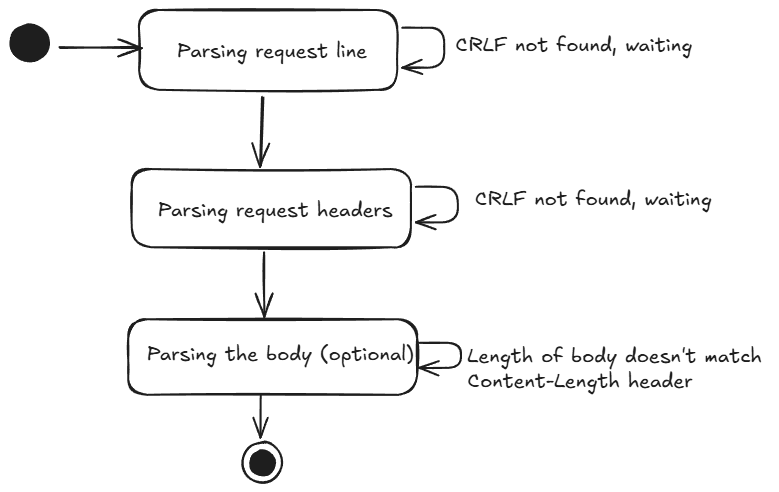

# http-from-tcp

## Building an HTTP/1.1 Server from Scratch in Go

This project demonstrates how to build an HTTP/1.1 server directly on top of TCP sockets, following the official RFC documentation. It aims to provide a deep understanding of how HTTP works under the hood.

---

## Table of Contents

- [Goals](#goals)
- [Project Overview](#project-overview)
- [Relevant RFCs](#relevant-rfcs)
- [How HTTP Works](#how-http-works)
- [HTTP Message Format](#http-message-format)
- [Parsing HTTP Data](#parsing-http-data)
- [Building HTTP Responses](#building-http-responses)
- [Chunked Transfer Encoding](#chunked-transfer-encoding)
- [Binary Data Support](#binary-data-support)
- [State machine for parsing HTTP request](#state-machine-for-http-parsing)

---

## Goals

- Understand the core concepts of HTTP.
- Implement HTTP/1.1 from scratch using TCP sockets in Go.
- Learn by referencing and applying the official RFC documentation.

## Project Overview

HTTP is a text-based protocol that operates over TCP. This project implements a basic HTTP/1.1 server by handling raw TCP connections, parsing HTTP requests, and generating HTTP responses.

Key challenges addressed:
- Receiving and processing data from TCP streams.
- Parsing incomplete or chunked data, as TCP is a streaming protocol.

## Relevant RFCs


This project refers to:
- [**RFC 9110**: HTTP Semantics](https://datatracker.ietf.org/doc/html/rfc9110)
- [**RFC 9112**: HTTP/1.1](https://datatracker.ietf.org/doc/html/rfc9112)

These are the latest and most complete specifications for HTTP/1.1.

## How HTTP Works

HTTP messages (requests and responses) are structured as follows:

```
start-line CRLF
*( field-line CRLF )
CRLF
[ message body ]
```

| Part                  | Example                        | Description                                                      |
|-----------------------|--------------------------------|------------------------------------------------------------------|
| start-line CRLF       | `POST /users/quck HTTP/1.1`    | Request line (request) or status line (response)                 |
| *( field-line CRLF )  | `Host: google.com`             | Key-value HTTP headers (optional)                                |
| CRLF                  |                                | Blank line separating headers from body                          |
| [ message body ]      | `{ "name": "quck" }`           | Body of the message (optional)                                   |

**Example HTTP Requests:**

```
GET /users HTTP/1.1
Host: localhost:42069
User-Agent: curl/7.81.0
Accept: */*


POST /user HTTP/1.1
Host: localhost:42069
User-Agent: curl/8.6.0
Accept: */*
Content-Type: application/json
Content-Length: 22

{"flavor":"dark mode"}
```

## Parsing HTTP Data

1. **Request Line**
    - Format: `method SP request-target SP HTTP-version`
    - Example: `GET /index.html HTTP/1.1`
    - HTTP-version: `HTTP/1.1`

2. **Headers**
    - Case-insensitive key-value pairs.
    - RFC refers to them as `field-line`.
    - Format: `field-name: [optional whitespace] field-value`

3. **Body**
    - No strict rules; just a byte array. Parsing is straightforward after headers.

## Building HTTP Responses

HTTP responses follow the same message format as requests, but the start-line is called the status line.

Some common headers included:
- `Content-Length`
- `Connection` (keep-alive or close)
- `Content-Type` (MIME type)

Each HTTP endpoint has its own handler, and a new goroutine is spawned to serve each new request.

## Chunked Transfer Encoding

For streaming large or unknown amounts of data (e.g., big files, live feeds), HTTP uses chunked transfer encoding via the `Transfer-Encoding` header instead of `Content-Length`.

**Chunked body format:**

```
<n>\r\n
<data of length n>\r\n
... repeat ...
0\r\n
\r\n
```
Chunks are written until finished. The final chunk is `0` to indicate the end.

## Binary Data Support

HTTP can transmit binary data (e.g., images, videos) by setting the appropriate `Content-Type` header. This tells the client how to interpret the body.

## State Machine for HTTP Parsing

Parsing HTTP requests is handled using a simple state machine, which helps manage the different stages of reading and interpreting the incoming data stream. This approach ensures that the server can correctly process requests even when data arrives in chunks or is incomplete.

The diagram below illustrates the state transitions involved in parsing an HTTP request:

<div align="center">
    
</div>

The same state machine concept is applied when writing HTTP responses, ensuring consistency and reliability in both request handling and response generation.
